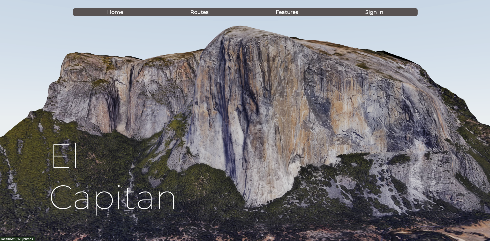
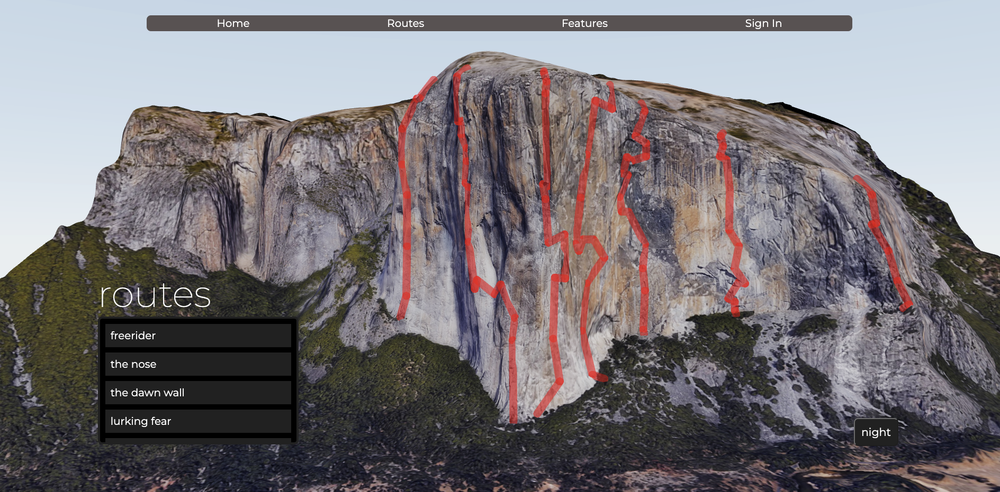
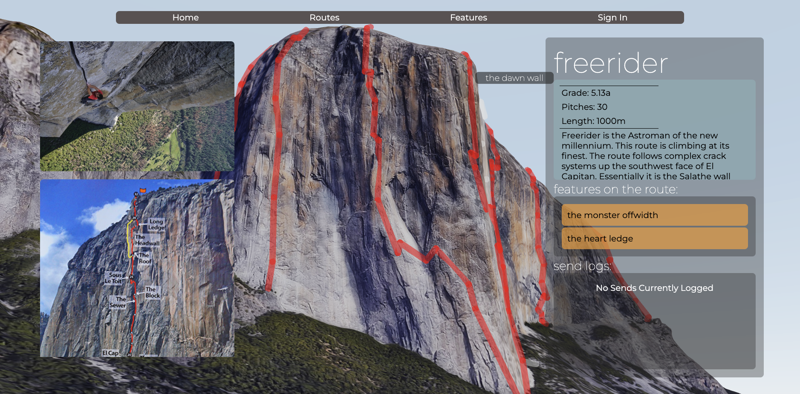
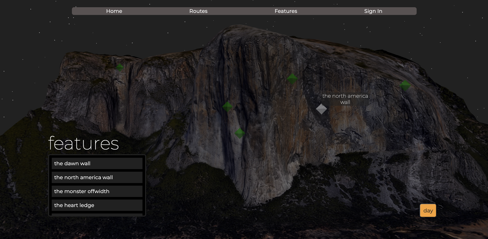
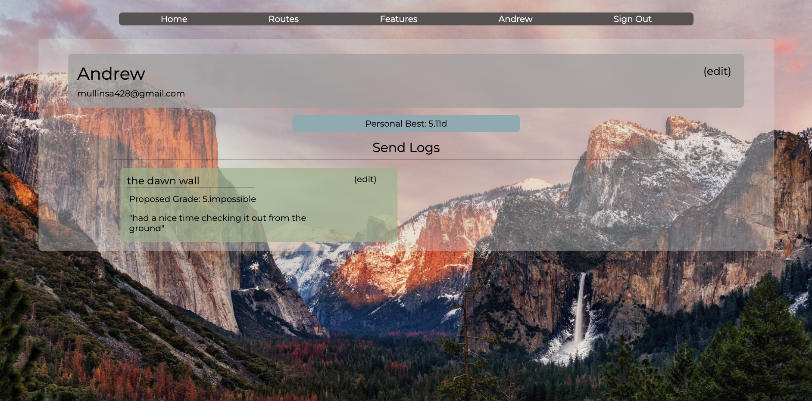

# El Capstone

El Capstone is an interactive face of El Capitan that lets users learn about various climbs on it's faces or log personal attempts and sends of the routes. All models created using THREE js (predominantly the react THREE fiber and drei libraries).

## Features

-   **Interactive El Capitan**: Navigate accross the various faces of el cap clicking on different routes and features on the wall to learn more about them.

-   **Logging Sends**: Click on individual routes to see what other users have climbed the route and their thoughts on the climb. Login to post a send of a climb yourself.

-   **Login**: Sign in to edit previous send logs or personal information.

## Images

## Technologies

-   **React**: A JavaScript library for building user interfaces.
-   **React Router**: A routing library for React applications.
-   **Three.js Fiber and Drei**: React Oriented Three.js libraries for creating WebGL-based visualizations.
-   **Axios**: A promise-based HTTP client for making API calls.
-   **CSS**: Styling of html components

## Future Plans

-   Deployment
-   Secure login using OAuth
-   Time and Weather adjustments

## Relevant Links

-   [Deployed Site]()

## Citations

-   El Cap model acquired from [Sketchfab](https://sketchfab.com/3d-models/el-capitan-ec8286fe454a4912805fbc2d80e3e739)
-   Most route descriptions and pictures were taken from [TheMountainProject](https://www.mountainproject.com/)
-   Additional Information Sources:
    -   [Eurekalert](https://www.eurekalert.org/multimedia/652406)
    -   [REI](https://www.rei.com/blog/climb/the-climber-in-the-unicorn-suit)
    -   [FlashPumped](https://flashpumped.com/blog/the-routes-of-el-capitan/)

## Contact Me

[Andrew Mullins](https://github.com/wamullins) Email:[mullinsa428@gmail.com](mailto:mullinsa428@gmail.com)
